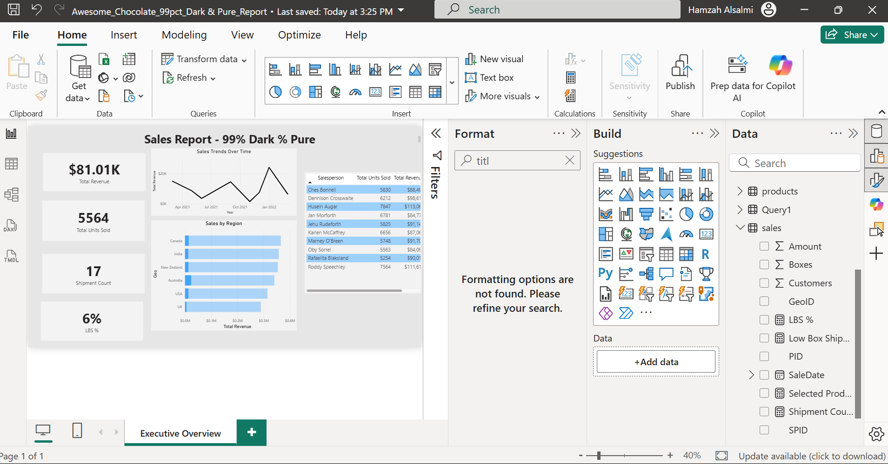

# Awesome Chocolate – 99% Dark & Pure Sales Analysis

## Overview
This project is an end-to-end sales analysis focused on the **99% Dark & Pure chocolate product line**.  
The goal was to demonstrate practical data analysis skills using **MySQL** for data extraction and **Power BI** for modeling and visualization.

The analysis answers key business questions around revenue, units sold, regional performance, and salesperson contribution for a specific high-purity product segment.

---
## Dashboard Preview 

### Executive Overview

## Tools Used
- **MySQL** – data storage, joins, and querying  
- **Power BI** – data modeling, DAX measures, and dashboard creation  
- **GitHub** – project documentation and version control  

---

## Data Model
The dataset consists of the following tables:
- `sales`
- `products`
- `people`
- `geo`

These tables were joined in MySQL using product and geographic keys to create a unified sales dataset before being loaded into Power BI.

---

## Key Analysis
- Total revenue and units sold for the **99% Dark & Pure** product
- Sales trends over time
- Revenue performance by region
- Salesperson contribution and ranking
- Shipment count and weight percentage (LBS %)

---

## Dashboard
The Power BI dashboard includes:
- KPI cards for revenue, units sold, shipments, and weight %
- Line chart showing sales trends over time
- Bar chart showing revenue by region
- Table ranking salespeople by performance

Screenshots of the dashboard are included in this repository.

---

## Files in This Repository
- `Awesome_Chocolate_99pct_Dark_Pure_Report.pbix` – Power BI report
- `awesome_chocolates_database.sql` – MySQL database dump
- `dashboard_overview.png` – dashboard overview screenshot
- `zoomed_overview.png` – detailed dashboard view

---

## How to Use
1. Import the SQL file into MySQL to recreate the database
2. Open the Power BI file (`.pbix`)
3. Refresh the data connection if needed
4. Explore the dashboard and visuals

---
